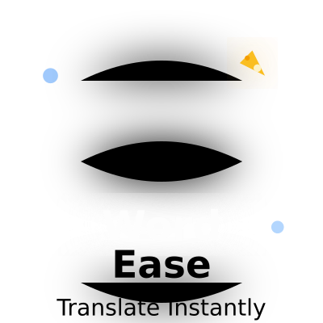

<div align="center">



# WordEase

**Instant text translation, right where you read.**

Select any text on any webpage — WordEase translates it immediately, no copy-paste, no new tabs, no friction.

[](https://github.com/Sridevbaag/WordEase-chrome-extension/releases)
[](https://developer.chrome.com/docs/extensions/mv3/)
[](LICENSE)
[](https://developer.mozilla.org/en-US/docs/Web/JavaScript)
[](https://github.com/Sridevbaag/WordEase-chrome-extension/commits)

</div>

---

## Table of Contents

- [Overview](#overview)
- [Features](#features)
- [Screenshots](#screenshots)
- [Supported Languages](#supported-languages)
- [Installation](#installation)
- [How to Use](#how-to-use)
- [Project Structure](#project-structure)
- [Architecture](#architecture)
- [APIs Used](#apis-used)
- [Permissions Explained](#permissions-explained)
- [Contributing](#contributing)
- [Author](#author)
- [License](#license)

---

## Overview

WordEase is a Chrome Extension (Manifest V3) that delivers **instant, in-page translation** when you highlight text. Instead of switching apps or opening a new tab, a sleek glassmorphism popup appears right at your cursor with the translation — complete with a progress timer, copy button, and text-to-speech support.

Built for students, researchers, and multilingual readers who want to stay in the flow while browsing.

---

## Features

| Feature | Description |
|---|---|
| ⚡ **Instant Translation** | Highlight any text → translation appears in under a second |
| 🔊 **Text-to-Speech** | Hear the translation spoken aloud in the target language |
| 📋 **One-click Copy** | Copy the translation directly from the popup |
| 🔄 **Fallback API** | If the primary API fails, a secondary API kicks in automatically |
| 🧠 **Session Cache** | Repeated words are served instantly from memory (LRU, 100 entries) |
| 🖱️ **Right-click Menu** | Translate via browser context menu — no keyboard needed |
| ⌨️ **Keyboard Shortcut** | Press `Alt+T` to translate selected text instantly |
| 📜 **Translation History** | Last 30 translations saved, searchable, and exportable |
| ⬇️ **Export History** | Download your full history as a `.json` file |
| 📊 **Stats Dashboard** | Track total translations, top language, and days active |
| ⏱️ **Configurable Popup Timer** | Adjust how long the popup stays visible (2–15 seconds) |
| 🌙 **Dark Mode** | Automatically matches your system theme |
| 🔁 **Live Settings Sync** | Changes in Options take effect on open tabs immediately |
| 🧹 **Auto Cleanup** | History entries older than 30 days are removed automatically |
| 🏅 **Milestone Notifications** | Chrome notification every 50 translations |

---

## Screenshots

> *(Add your screenshots here after loading the extension)*

| Popup | History | Settings |
|---|---|---|
| `screenshots/popup-translation.png` | `screenshots/history.png` | `screenshots/settings.png` |

---

## Supported Languages

WordEase supports **20 languages** across three regional groups:

### 🇮🇳 Indian Languages
| Code | Language | Script |
|---|---|---|
| `hi` | Hindi | हिंदी |
| `bn` | Bengali | বাংলা |
| `ta` | Tamil | தமிழ் |
| `te` | Telugu | తెలుగు |
| `ml` | Malayalam | മലയാളം |
| `mr` | Marathi | मराठी |
| `gu` | Gujarati | ગુજરાતી |
| `kn` | Kannada | ಕನ್ನಡ |

### 🌍 European Languages
| Code | Language |
|---|---|
| `en` | English |
| `fr` | French |
| `es` | Spanish |
| `de` | German |
| `it` | Italian |
| `pt` | Portuguese |
| `ru` | Russian |
| `nl` | Dutch |

### 🌏 Asian Languages
| Code | Language | Script |
|---|---|---|
| `ja` | Japanese | 日本語 |
| `zh` | Chinese (Simplified) | 中文 |
| `ko` | Korean | 한국어 |
| `ar` | Arabic | العربية |

> **Note on English:** Selecting English as the target automatically detects the source language (`auto|en`), making it useful for translating non-English pages into English.

---

## Installation

### From GitHub (Developer Mode)

1. **Download** this repository:
   ```
   git clone https://github.com/Sridevbaag/WordEase-chrome-extension.git
   ```
   Or click **Code → Download ZIP** and extract it.

2. **Open Chrome** and navigate to:
   ```
   chrome://extensions
   ```

3. **Enable Developer Mode** using the toggle in the top-right corner.

4. Click **Load unpacked** and select the extracted folder.

5. The WordEase icon will appear in your Chrome toolbar. **Pin it** for easy access.

> No build step required. This is a pure JavaScript extension — no npm, no bundler.

---

## How to Use

### Translate Text
1. Visit any webpage.
2. **Highlight any word or sentence** with your mouse.
3. A translation popup appears automatically below the selection.

### Use the Popup
- **🔊** — Listen to the translation spoken aloud.
- **📋** — Copy the translated text to clipboard.
- **✕** — Dismiss the popup immediately.
- The progress bar at the bottom shows the remaining display time.
- Hovering over the popup pauses the auto-close timer.

### Keyboard Shortcut
Press `Alt+T` on any page to translate whatever text you have selected.

### Right-click Menu
Right-click on any selected text → **"Translate '...' with WordEase"**.

### View History
Click the **WordEase icon** in the toolbar to open the history popup.
- **Search** through past translations using the search bar.
- **Click an item** → copies the original text.
- **Shift+click an item** → copies the translated text.
- **Export JSON** → downloads your full history.

### Change Settings
Click the **⚙️ Options** link (or right-click the toolbar icon → Options) to:
- Choose your target language.
- Adjust how long the popup stays visible.
- Toggle the Text-to-Speech button on/off.
- View your translation stats.
- Clear history.

---

## Project Structure

```
WordEase-chrome-extension/
│
├── manifest.json          # Extension configuration (Manifest V3)
├── background.js          # Service worker — context menu, alarms, stats, notifications
├── content.js             # Injected into all pages — selection listener, popup, translation
├── styles.css             # Popup styles injected into host pages
│
├── popup.html             # History popup (toolbar icon)
├── popup.js               # History popup logic — search, copy, export
│
├── options.html           # Settings page
├── options.js             # Settings logic — save, stats, clear
│
└── icons/
    ├── icon16.png
    ├── icon48.png
    └── icon128.png
```

---

## Architecture

```
┌─────────────────────────────────────────────────┐
│                   Chrome Browser                │
│                                                 │
│  ┌──────────────┐      ┌──────────────────────┐ │
│  │  Web Page    │      │   background.js      │ │
│  │              │      │   (Service Worker)   │ │
│  │  content.js  │◄────►│                      │ │
│  │  styles.css  │      │  • Context Menu      │ │
│  │              │      │  • Keyboard Commands │ │
│  │  • Selection │      │  • Stats Tracking    │ │
│  │  • Popup UI  │      │  • Notifications     │ │
│  │  • TTS       │      │  • History Cleanup   │ │
│  │  • Cache     │      └──────────────────────┘ │
│  └──────┬───────┘                               │
│         │                                       │
│         │  chrome.storage.sync                  │
│         ▼                                       │
│  ┌──────────────┐      ┌──────────────────────┐ │
│  │  popup.html  │      │   options.html       │ │
│  │  popup.js    │      │   options.js         │ │
│  │              │      │                      │ │
│  │  • History   │      │  • Language select   │ │
│  │  • Search    │      │  • Duration slider   │ │
│  │  • Export    │      │  • TTS toggle        │ │
│  └──────────────┘      │  • Stats dashboard   │ │
│                        └──────────────────────┘ │
└─────────────────────────────────────────────────┘
         │
         ▼
┌─────────────────────────┐
│  Translation APIs       │
│                         │
│  Primary:               │
│  MyMemory Translate     │
│  api.mymemory.          │
│  translated.net         │
│                         │
│  Fallback:              │
│  Lingva Translate       │
│  lingva.ml              │
└─────────────────────────┘
```

**Data flow for a translation:**
1. User selects text on a page → `content.js` detects `mouseup`
2. Check session cache — serve instantly if found
3. If not cached → call MyMemory API (6s timeout)
4. If MyMemory fails → call Lingva Translate (6s timeout)
5. Result stored in cache + saved to `chrome.storage.sync` history
6. Popup rendered with translation, TTS, and copy button
7. Background service worker updates stats in `chrome.storage.local`

---

## APIs Used

### MyMemory Translated (Primary)
- **URL:** `https://api.mymemory.translated.net/get`
- **Type:** Free, no API key required
- **Docs:** [mymemory.translated.net](https://mymemory.translated.net/doc/spec.php)
- **Limit:** 5,000 words/day for anonymous use

### Lingva Translate (Fallback)
- **URL:** `https://lingva.ml/api/v1/`
- **Type:** Free, open-source Google Translate frontend
- **Repo:** [github.com/thedaviddelta/lingva-translate](https://github.com/thedaviddelta/lingva-translate)
- **Used when:** MyMemory times out or returns an error

---

## Permissions Explained

| Permission | Why it's needed |
|---|---|
| `storage` | Save settings and history via `chrome.storage.sync` and `.local` |
| `activeTab` | Send messages to the active tab (keyboard shortcut trigger) |
| `notifications` | Show milestone notifications (e.g. "50 translations!") |
| `alarms` | Schedule daily cleanup of history older than 30 days |
| `contextMenus` | Add "Translate with WordEase" to the right-click menu |
| `host_permissions` | Allow fetch calls to the two translation API domains |

---

## Contributing

Contributions are welcome! Here's how to get started:

1. Fork the repository.
2. Create a feature branch:
   ```
   git checkout -b feature/your-feature-name
   ```
3. Make your changes and test them locally via `chrome://extensions` → Load unpacked.
4. Commit with a clear message:
   ```
   git commit -m "feat: add your feature description"
   ```
5. Push and open a Pull Request.

### Ideas for contribution
- Add support for detecting the source language automatically
- Add a mini-dictionary panel (definitions, synonyms)
- Support translating selected text in PDF viewer
- Add more target languages
- Write unit tests with Jest + Chrome Extension testing utilities

---

## Author

**Sridev Bag**
- GitHub: [@Sridevbaag](https://github.com/Sridevbaag)
- Project: [WordEase Chrome Extension](https://github.com/Sridevbaag/WordEase-chrome-extension)

BCA Student · Sister Nivedita University, Kolkata  
Interested in Full Stack Development, Android, and building useful tools.

---

## License

This project is licensed under the [MIT License](LICENSE).

You are free to use, modify, and distribute this project. Attribution appreciated but not required.

---

<div align="center">

Made with ❤️ by Sridev Bag

⭐ Star this repo if WordEase made your browsing easier!

[⬆ Back to top](#wordease)

</div>
